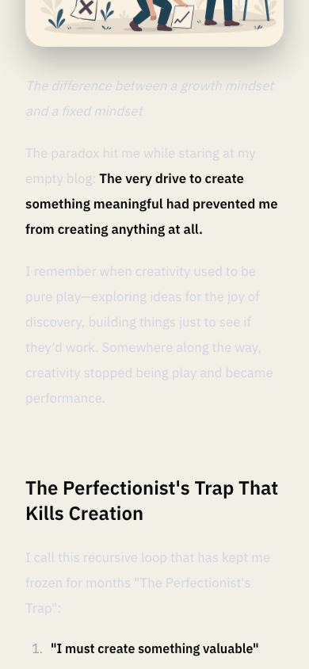
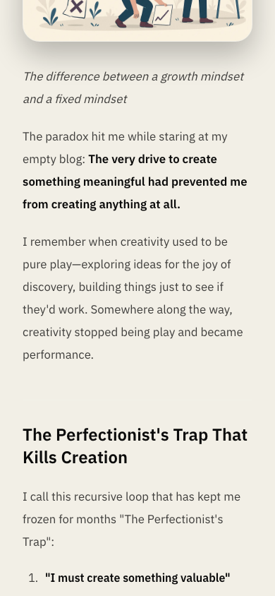

# Local production audit — October 2, 2026

Baseline: `e52cc7b5381e5d7809e04909217afcc97b917e6d` (`origin/main`). Changes were made in an isolated worktree on `fix/measured-site-performance`. Published posts and content data are unchanged.

## Demonstrated problems and fixes

- Light-mode MDX paragraphs inherited the dark typography palette: approximately **1.28:1** contrast on paper. They now use the site's existing secondary text color. Small light-orange links measured **4.36:1**; the accent is slightly darker. The green accent also needed a small adjustment on tinted article panels. Dark palettes and page layout are preserved.
- The newsletter overlay had no dialog semantics, left initial focus outside, and ignored Escape. It now uses a native modal dialog, focuses the email input, cycles keyboard focus at the boundaries, closes on Escape/backdrop/Close, and restores trigger focus. Closing also updates React state immediately so rapid reopening works.
- The skip link scrolled to main content but left focus on the body. The main landmark can now receive that focus without entering the ordinary Tab order.
- Native mobile scrolling exposed only part of the focused Interfaces and Infrastructure section chips. The Notes index now reveals each focused chip fully. An inset ring stays inside the horizontal clipping area.
- The browser downloaded an unused Mono 500 font because it was preloaded. Monospace text in the sampled routes uses weight 400; source inspection found no code spans/fences in the published posts. Removing weight 500 cuts font delivery from **60,352 to 50,292 bytes** on every sampled route, a **16.7% reduction**. The used fonts remain self-hosted with `font-display: swap`.
- `SocialBar` has no client state, effects, or handlers. Rendering it on the server removes **291 compressed JavaScript bytes** from the homepage. Its links use the existing focus-ring utility.

## Measurements

The [results](results.json) include route-level before/after medians, compressed script/font bytes, settled axe findings, and Lighthouse medians. Exact route names are recorded there.

| Route             | Delivered JS bytes, before → after | Lighthouse mobile score | Mobile LCP median, ms |
| ----------------- | ---------------------------------: | ----------------------: | --------------------: |
| Home              |                  152,030 → 151,739 |                 94 → 95 |         3,028 → 2,866 |
| Portfolio         |                  151,739 → 151,739 |                 98 → 98 |         2,343 → 2,405 |
| Notes             |                  147,079 → 147,117 |                 95 → 95 |         2,945 → 2,937 |
| Devotion          |                  151,156 → 151,476 |                 96 → 97 |         2,787 → 2,636 |
| Illustrated essay |                  151,156 → 151,476 |                 93 → 94 |         3,160 → 3,155 |

Delivered script bytes were the same at both browser widths. Font bytes were 60,352 → 50,292 on every route. Initial-load CLS was 0 before and after. Default-dark Lighthouse accessibility was 100 before and after; the palette checks exposed issues that the default Lighthouse run did not.

Cold browser contexts were used three times per route at **1280 × 800** and **390 × 844**, DPR 1. The five routes were the homepage, portfolio, Notes, a devotion with series/TOC, and an illustrated essay with lists. Resource Timing `encodedBodySize` reports delivered asset body bytes; HTTP headers and RSC navigation/prefetch payloads are not included in the script totals. Fonts and application rendering were allowed to finish before sampling. LCP/CLS observers ran from document startup.

Axe 4.11.0 checked WCAG A/AA rules in all four settled palettes at both widths. A 500 ms pause avoids measuring temporary colors during palette transitions. The final scans have **zero violations in all 40 page/palette cases**, plus both light-orange newsletter dialog cases. Initial scans without that pause were discarded. This is a sampled audit, not a claim of complete WCAG conformance.

The final **320, 390, and 1280 px** checks show zero document overflow on all five routes. The mobile index intentionally scrolls horizontally inside its container. Keyboard checks cover the skip link, all section chips, native build-details expansion, newsletter focus cycling and closure, and visible social-link focus. Stored green/light appearance settings survive reload without hydration errors. No page errors or failed asset responses were observed during the measured page loads.

Images already use responsive Next image delivery for the headshot/product previews and local SVG/favicons. The illustrated MDX post serves an existing 93 KB WebP. No broken-image delivery or initial-load CLS was demonstrated, so no image or content-pipeline rewrite was added.

## Tradeoffs and uncertainty

The dialog adds a small amount of client JavaScript to posts; the Notes focus handler also adds a small amount to Notes. The font reduction is substantially larger than either increase. Remaining interactive components need browser APIs, route state, or form state and were retained.

Lighthouse uses its standard simulated mobile throttling, three runs per URL, and the repo's existing thresholds. The desktop/mobile context measurements are unthrottled local lab results. Cache state, this Mac's CPU, other audit processes, and millisecond-scale variation limit timing conclusions; no claim is made about real-user LCP or INP. Browser width emulation is not physical-phone testing. Screen-reader behavior and contrast over every image/gradient/hover state were not exhaustively assessed. The Next production server was tested locally; no Cloudflare deployment was performed.

## Reproduce

Use the same Node/pnpm/dependencies for both revisions. This run used Node 26.10.0, pnpm 10.15.0, Next 16.3.6, Playwright 1.63.0, and Chromium 153.0.8010.12. CI uses Node 22, so its timing may differ.

```sh
pnpm install --frozen-lockfile
pnpm build
pnpm start --port 3105
```

In another terminal:

```sh
mkdir -p /tmp/personal-site-audit
curl -fsSL https://unpkg.com/axe-core@4.11.0/axe.min.js -o /tmp/personal-site-audit/axe.min.js
node docs/audits/2026-10-02/measure.cjs /tmp/personal-site-audit/replay
CI=true PLAYWRIGHT_BASE_URL=http://127.0.0.1:3105 pnpm test:e2e --workers=1 --retries=0
```

The [measurement script](measure.cjs) writes raw metrics and screenshots without changing the site. Run it against the baseline checkout and this branch with fresh browser contexts; `AUDIT_ORIGIN` and `AXE_PATH` can override the local URL and axe file. The original scripts, raw captures, Lighthouse reports, and gate logs remain in `/tmp/personal-site-audit/` on this Mac.

For Lighthouse, copy `lighthouserc.json` to a temporary file, change port 3000 to 3105, append the illustrated essay URL, and remove the `upload` block. Run `@lhci/cli@0.14.0 collect` and `assert` from separate before/after directories, with `CHROME_PATH` set to the same Chromium executable. Nothing was uploaded to Lighthouse public storage.

Validation: `pnpm check` (18 suites, 128 tests), `pnpm quality:gate`, production `pnpm build`, **13 production E2E tests**, and the local Lighthouse assertions all pass.

## Screenshots

The Notes before image captures the old index behavior immediately before its focus fix, after the other audit fixes had been built. The prose before images come from the baseline build.

Mobile light-mode prose, before and after:

| Before                                                     | After                                                        |
| ---------------------------------------------------------- | ------------------------------------------------------------ |
|  |  |

[Desktop prose before](before-prose-desktop.png) · [Desktop prose after](after-prose-desktop.png) · [Dialog before](before-dialog-desktop.png) · [Dialog after, with email focus](after-dialog-desktop.png) · [Mobile chip before](before-notes-focus-mobile.png) · [Mobile chip after](after-notes-focus-mobile.png)
